# CLOUD INFRASTRUCTURE RUNBOOK FOR DIGITAL COLLECTIONS

**Document ID:** aws-setup.md  
**Version:** 1.0   
**Maintainer:** Sai Kiran Boppana & LaTaevia Berry   
**Last Updated:** Oct 17 2025  
**Review Cycle:** Quarterly 

## Document Overview

This runbook outlines the end-to-end deployment process for a cloud-hosted Omeka S infrastructure tailored for higher education digital collections. It combines platform-agnostic principles with detailed AWS implementation guidance, allowing institutions to adapt to the same architecture on AWS, Azure, Google Cloud, or other platforms according to their technical capacity and budget.

The design follows a four-tier environment model—Development, Testing, Staging, and Production—to ensure strict isolation between internal development systems and publicly accessible services. This structure promotes secure, reliable workflows while providing high-availability access for users exploring digital archives online.

## Scope and Applicability

**Applies To:**
- All Omeka S deployments in HBCU/ higher education environments
- AWS regions: us-east-1, us-west-2 (adjust per institution)
- Environment tiers: Development, Testing, Staging, Production

## Target Audience

This documentation is written for:
- **Primary:** Full-stack engineers and DevOps professionals responsible for initial deployment
- **Secondary:** System administrators managing ongoing maintenance and scaling
- **Tertiary:** Technical project managers overseeing infrastructure decisions

Readers should have basic familiarity with cloud computing concepts, networking fundamentals, and Linux system administration.

## Service Equivalency Matrix

For multi-cloud deployments, refer to this service comparison:

| Service Category | AWS | Azure | Google Cloud |
|-----------------|-----|-------|--------------|
| Compute | EC2 | Virtual Machines | Compute Engine |
| Database | RDS MySQL | Azure Database for MySQL | Cloud SQL |
| Storage | S3 | Blob Storage | Cloud Storage |
| IAM | IAM | Azure AD + RBAC | Cloud IAM |
| DNS | Route 53 | Azure DNS | Cloud DNS |
| SSL/TLS | ACM | App Service Certificates | Certificate Manager |

## Prerequisites

Before starting the deployment, ensure all technical, organizational, and environmental requirements are met. This section outlines the accounts, permissions, skills, tools, and information you'll need to complete the setup successfully.

### 2.1 AWS Account and Permissions

Before beginning this deployment, verify that you have an active AWS account with the necessary IAM permissions. Your IAM user or role should have full administrative access to the following services:

**Core Services Required:**
- **Compute & Networking:** EC2, VPC
- **Storage & Databases:** S3, RDS
- **Security & Monitoring:** IAM, CloudWatch, Systems Manager
- **DNS & CDN:** Route 53, CloudFront (optional)

**Specific Permission Requirements:**

| Action | Service | Permission Level |
|--------|---------|-----------------|
| Create/configure EC2 instances | EC2 | Full Access |
| Manage security groups and key pairs | EC2 | Full Access |
| Modify VPC components | VPC | Full Access |
| Deploy RDS instances | RDS | Full Access |
| Create S3 buckets and policies | S3 | Full Access |
| Configure IAM roles and policies | IAM | Full Access |
| Manage CloudWatch logs | CloudWatch | Read/Write |
| Access Systems Manager sessions | SSM | Full Access |

> **Important:** If operating within a shared institutional AWS account, confirm with your AWS administrator that you have these permissions, or request temporary elevated privileges for the initial deployment.

**Required Information to Document:**
- [ ] AWS Account ID: 
- [ ] Primary Region: 
- [ ] VPC Name/ID: 
- [ ] Availability Zones: 

### 2.2 Technical Knowledge Requirements

This runbook assumes familiarity with key concepts and tools across infrastructure and web application management.

**Required Knowledge:**
- **Networking fundamentals:** subnets, CIDR notation, public vs. private IPs, security groups
- **Linux system administration:** SSH access, file permissions, package management, log review
- **Web server management:** Apache configuration, PHP runtime settings, service restarts
- **Database connectivity:** basic SQL commands, MySQL/MariaDB structure, RDS endpoint configuration
- **DNS and domain management:** for production deployments

**Beneficial (Optional) Skills:**
- Infrastructure as Code (IaC) concepts (Terraform, AWS CDK, or CloudFormation)
- JSON/YAML syntax for AWS configurations and template files
- Git version control for configuration management

### 2.3 Required Tools and Software

Ensure the following tools are installed and properly configured on your local machine:

| Tool | Version | Purpose | Installation Notes |
|------|---------|---------|-------------------|
| AWS CLI | v2.x or later | Command-line AWS access | Configure using `aws configure` |
| SSH Client | Latest | Secure shell access | Built-in (macOS/Linux), PuTTY (Windows) |
| Text Editor | Any | Configuration editing | VS Code, Sublime Text, or Atom |
| Web Browser | Modern | AWS Console access | Chrome, Firefox, or Edge |
| Git | 2.x+ | Version control | Optional but recommended |

### 2.4 Environmental and Organizational Requirements

Coordinate with your institution's IT and finance teams to gather:

**Network Configuration:**
- [ ] Approved IP ranges for SSH access
- [ ] Approved IP ranges for RDS access 
- [ ] Firewall exceptions needed

**Organizational Standards:**
- [ ] Cost center codes
- [ ] Project name for tagging 
- [ ] Department identifier 
- [ ] Resource naming convention 

**Compliance Requirements:**
- [ ] HIPAA compliance needed: Yes/No
- [ ] FERPA compliance needed: Yes/No
- [ ] Data residency requirements 
- [ ] Encryption standards 

**Stakeholder Matrix:**

| Environment | Primary Users | Access Level | Authentication Method |
|------------|---------------|--------------|----------------------|
| Development | Developers | Full | SSH Key |
| Testing | QA Team | Limited | SSH Key |
| Staging | Stakeholders | Read-only | HTTPS |
| Production | Public | Read-only | HTTPS |

### 2.5 Pre-Deployment Checklist

Complete these tasks before launching any AWS resources:

- [ ] Create local workspace folder structure:
```
  omeka-deployment/
  ├── configs/
  ├── keys/
  ├── scripts/
  └── logs/
```
- [ ] Verify AWS service quotas:
  - [ ] EC2 instances (minimum 4 required)
  - [ ] Elastic IPs (minimum 1 for production)
  - [ ] RDS instances (minimum 1 required)
- [ ] Obtain Omeka S files:
  - [ ] Download latest stable version OR
  - [ ] Access organizational AMI ID 
- [ ] Set up credential management
  - [ ] Configure AWS Secrets Manager OR
  - [ ] Set up secure password manager
- [ ] Review policies:
  - [ ] Backup policy documented
  - [ ] Disaster recovery RTO/RPO defined
  - [ ] Change management process confirmed
- [ ] Production setup:
  - [ ] Domain/subdomain confirmed 
  - [ ] SSL certificate method chosen
  - [ ] Expected traffic documented 
- [ ] Integration requirements:
  - [ ] LDAP endpoint
  - [ ] SSO configuration 
  - [ ] Storage integration 

## Outcome

Once these prerequisites are met, you will have:
- A verified AWS account with required permissions
- The tools and credentials ready for secure deployment
- Institutional compliance and budget approvals documented
- A clear, consistent workspace for the infrastructure build

## 1. Elastic Cloud Compute (EC2) - Virtual Server Provisioning

### Conceptual Overview

A compute instance is a virtual server that runs your application code. In this architecture, we deploy four separate compute instances, one for each environment (Development, Testing, Staging, Production). These instances run on a LAMP stack (Linux, Apache, MySQL client, PHP) with the application pre-installed.

The key principle is **isolation**: each environment has its own dedicated compute resources to prevent interference between development work and production operations. Private environments (Dev/Test) are isolated in private network segments accessible only through a secure jump server, while public environments (Stage/Prod) are accessible from the internet with appropriate security controls.

### AWS Implementation: EC2 Instance Setup

#### Step 1: Open AWS Console and Search for EC2

Navigate to the AWS Console and search for "EC2" in the service search bar. Select **EC2 – Virtual Servers in the Cloud** from the list.

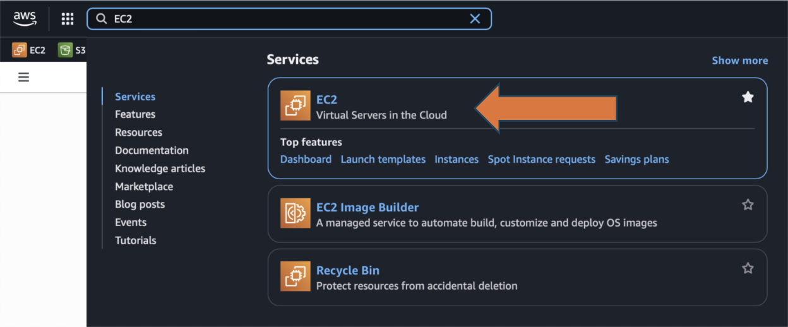

#### Step 2: Launch Instance Configuration

Navigate to the EC2 Dashboard in AWS Console. Click **"Launch Instance"** to begin the provisioning process.

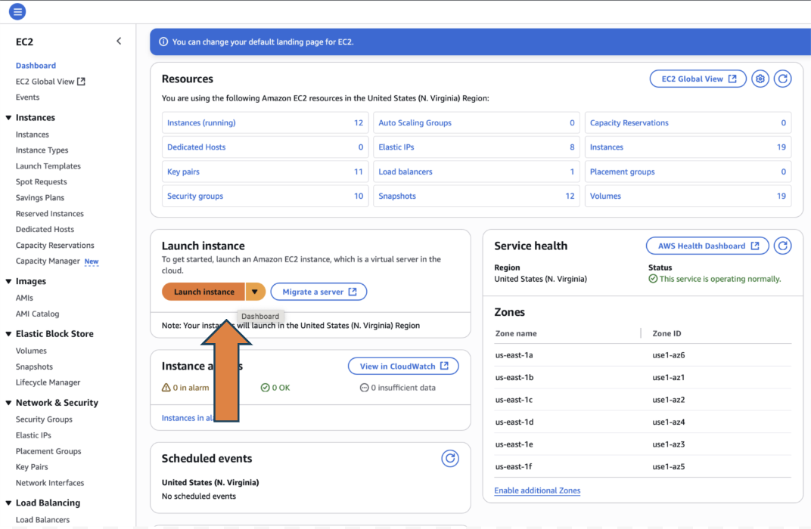

#### Step 3: Name and Tags Configuration

For each environment, use a consistent naming convention:

| Environment | Instance Name |
|------------|---------------|
| Development | `omeka-dev-instance` |
| Testing | `omeka-test-instance` |
| Staging | `omeka-stage-instance` |
| Production | `omeka-prod-instance` |

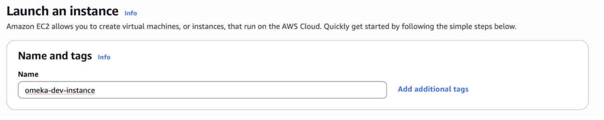

To add tags, click on the **"Add additional tags"** option next to the name field.

**Required Tags for Resource Management:**

| Key | Value |
|-----|-------|
| Environment | Dev (or Test/Stage/Prod) |
| Project | Omeka-Digital-Collections |
| Department | [Your Department Name] |
| CostCenter | [Your Cost Center Code] |

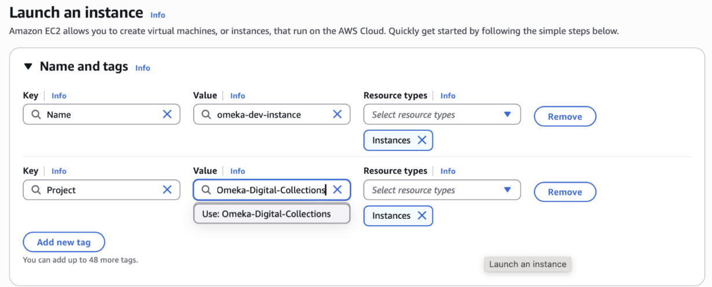

#### Step 4: AMI (Amazon Machine Image) Selection

You have two options for the base image:

**Option A - Custom AMI:**
If you have created a custom AMI with the application pre-installed:
- Go to **"My AMIs"** tab
- Select your custom image (e.g., "Application Installation - No MySQL")
- This AMI should include: Ubuntu 22.04 LTS, Apache 2.4, PHP 8.1, application files

**Option B - Base Ubuntu AMI (Manual Installation):**
- Select **"Ubuntu Server 24.04 LTS (HVM), SSD Volume Type"**
- Architecture: **64-bit (x86)**
- This option requires manual installation of all components

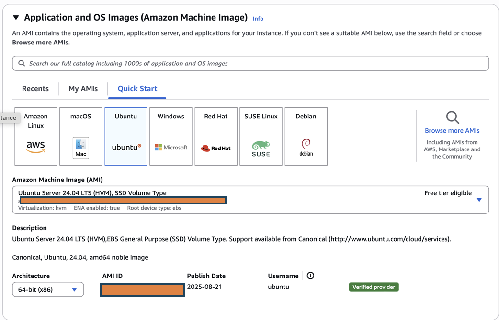

#### Step 5: Instance Type Selection

Select instance types based on environment requirements and expected load:

| Environment | Instance Type | Specifications | Use Case |
|------------|--------------|---------------|----------|
| **Development** | t3.medium | 2 vCPUs, 4 GiB Memory | Light development work, single developer access |
| **Testing** | t3.medium | 2 vCPUs, 4 GiB Memory | Automated testing, QA processes |
| **Staging** | t3.large | 2 vCPUs, 8 GiB Memory | Stakeholder reviews, pre-production validation |
| **Production** | m5.large | 2 vCPUs, 8 GiB Memory | Live public access, concurrent users |

> **Note:** m5 instances provide better network performance and dedicated hardware compared to t3

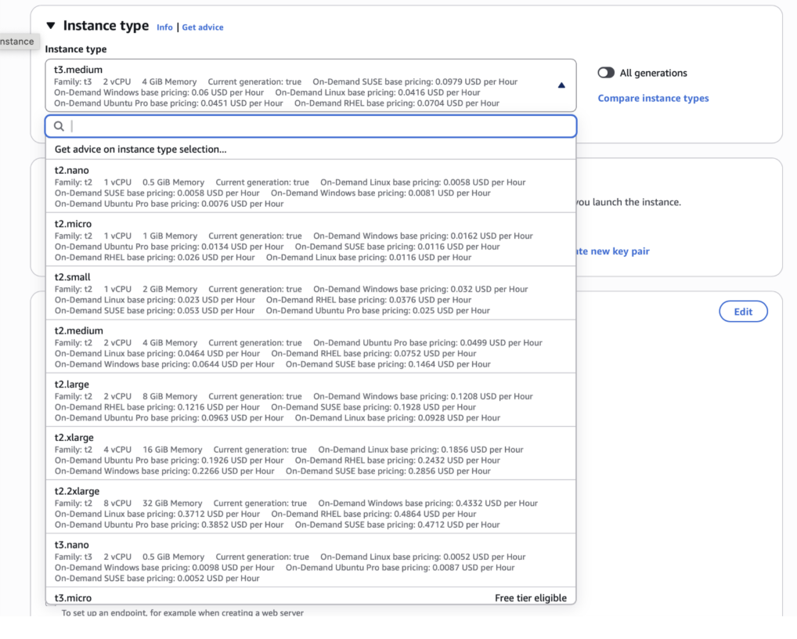

#### Step 6: Key Pair Configuration

Select an existing key pair or create a new one for SSH access:

**Creating a New Key Pair:**
1. Click **"Create new key pair"**
2. Key pair name: `omeka-environments-keypair`
3. Key pair type: **RSA**
4. Private key file format: **.pem** (for Mac/Linux) or **.ppk** (for Windows using PuTTY)
5. Click **"Create key pair"** and save the downloaded file securely

> **CRITICAL: Key Security**
> - **Linux/Mac:** `chmod 400 omeka-environments-keypair.pem`
> - **Windows:** Use file properties to restrict access to your user account only
> - Backup this key in a secure password manager or key management system
> - Never commit this key to version control or share via email

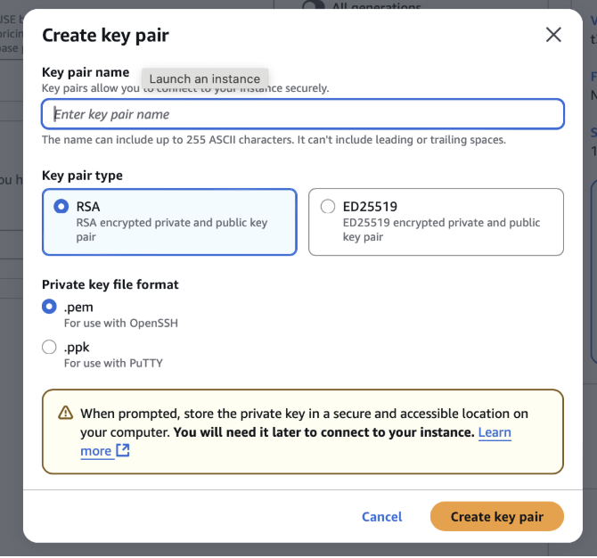

#### Step 7: Network Settings

Network configuration differs between private (Dev/Test) and public (Stage/Prod) environments:

**For Development and Testing (Private Environments):**

| Setting | Configuration |
|---------|--------------|
| **VPC** | Select your existing VPC (e.g., `Omeka-Project-VPC`) or default VPC |
| **Subnet** | Select private subnet |
| - Development | 10.0.3.0/24 (or your designated private subnet) |
| - Testing | 10.0.4.0/24 (or your designated private subnet) |
| **Auto-assign public IP** | **Disable** (these instances should not have direct internet access) |

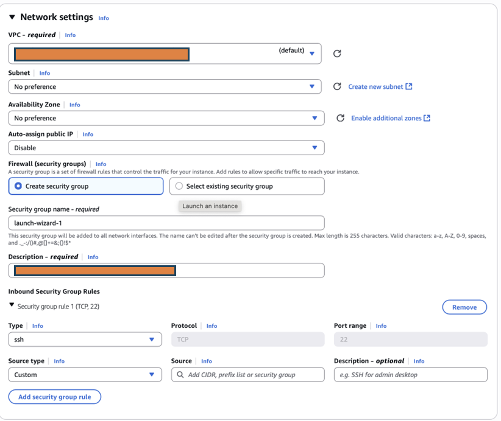

**For Staging and Production (Public Environments):**

| Setting | Configuration |
|---------|--------------|
| **VPC** | Select your existing VPC (e.g., `Omeka-Project-VPC`) |
| **Subnet** | Select public subnet |
| - Staging | 10.0.1.0/24 (or your designated public subnet) |
| - Production | 10.0.2.0/24 (or your designated public subnet) |
| **Auto-assign public IP** | **Enable** (these instances need internet accessibility) |

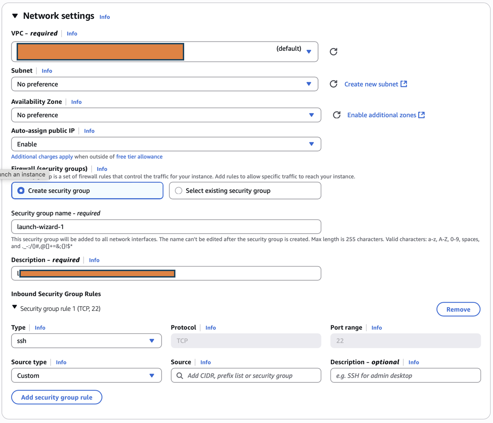

#### Step 8: Security Group Configuration

Security groups act as virtual firewalls controlling inbound and outbound traffic. Create separate security groups for each environment type:

**Bastion Host Security Group (Already Exists):**
- Name: `bastion-sg`
- Inbound Rules:
  - SSH (Port 22) from your institution's IP range
- Outbound Rules:
  - All traffic allowed

**Development/Testing Security Group:**
- Create new security group: `omeka-dev-test-sg`

| Rule Type | Protocol | Port | Source | Purpose |
|-----------|----------|------|--------|---------|
| **Inbound Rules** |
| SSH | TCP | 22 | Bastion security group ID | Administrative access |
| HTTP | TCP | 80 | Bastion security group ID | Testing via tunnel |
| Custom TCP | TCP | 3306 | Same security group | RDS access |
| **Outbound Rules** |
| All traffic | All | All | 0.0.0.0/0 | Package updates and API calls |

**Staging/Production Security Group:**
- Create new security group: `omeka-stage-prod-sg`

| Rule Type | Protocol | Port | Source | Purpose |
|-----------|----------|------|--------|---------|
| **Inbound Rules** |
| SSH | TCP | 22 | Bastion security group ID | Administrative access |
| HTTP | TCP | 80 | 0.0.0.0/0 | Public access |
| HTTPS | TCP | 443 | 0.0.0.0/0 | Secure public access |
| Custom TCP | TCP | 3306 | Same security group | RDS access |
| **Outbound Rules** |
| All traffic | All | All | 0.0.0.0/0 | All outbound connections |

#### Step 9: Storage Configuration

Configure the root EBS (Elastic Block Store) volume for the operating system and application files:

**Root Volume Configuration:**

| Setting | Dev/Test | Stage/Prod |
|---------|----------|------------|
| **Volume Type** | GP3 (General Purpose SSD) | GP3 (General Purpose SSD) |
| **Size** | 20 GiB | 50 GiB |
| **IOPS** | 3000 (default) | 3000 (default) |
| **Throughput** | 125 MiB/s (default) | 125 MiB/s (default) |
| **Delete on termination** | Yes | No (Production only) |
| **Encryption** | AWS managed keys | AWS managed keys |

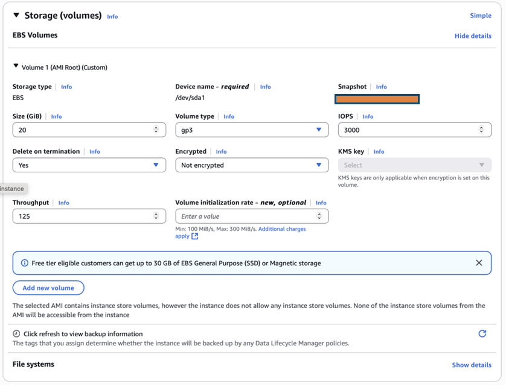

**Additional Storage Considerations:**
- Media files will be stored in S3, not on the instance
- Database will use RDS, not local storage
- Consider creating an AMI snapshot schedule for backup purposes

#### Step 10: Advanced Details - IAM Instance Profile

Attach an IAM role to allow the EC2 instance to access other AWS services:

**IAM Instance Profile Selection:**
- Select existing role or create new: `omeka-ec2-role`

This role should have the following policies attached:
- S3 access to environment-specific buckets
- CloudWatch logs write access
- Systems Manager (SSM) access for maintenance

> **Note:** For detailed IAM configuration, see Section 4: IAM (Identity and Access Management) Configuration

#### Step 11: Launch Instance and Verify

Review all settings in the Summary panel and click **"Launch Instance"**

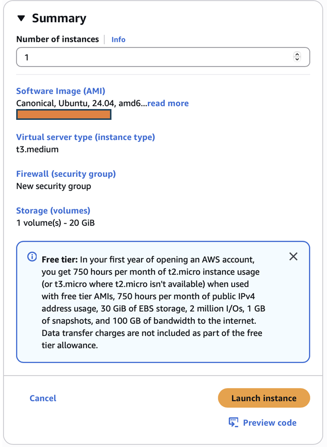

**Post-Launch Verification:**
1. Go to EC2 Dashboard → Instances
2. Wait for Instance State to show **"Running"**
3. Wait for Status Checks to show **"2/2 checks passed"**

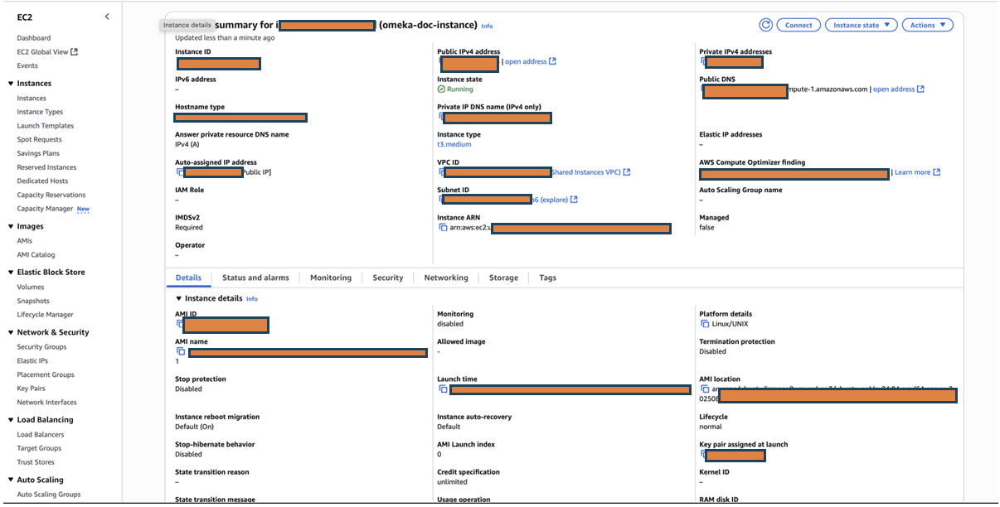

#### Step 12: Elastic IP Configuration (Production Environment Only)

Production requires a static IP address that persists even if the instance is stopped/started.

**Allocating an Elastic IP:**

1. Navigate to EC2 Dashboard → Network & Security → **Elastic IPs**
2. Click **"Allocate Elastic IP address"**
3. Configure settings:
   - Network Border Group: Select your region
   - Public IPv4 address pool: Amazon's pool of IPv4 addresses
4. Add Tags:
   - Key: `Name` | Value: `omeka-prod-eip`
   - Key: `Environment` | Value: `Production`
5. Click **"Allocate"**

**Associating Elastic IP with Production Instance:**

1. Select the newly allocated Elastic IP
2. Click **"Actions"** → **"Associate Elastic IP address"**
3. Configure:
   - Resource type: **Instance**
   - Instance: Select your production instance
   - Private IP address: Leave as default
   - Allow reassociation: **No** (unchecked)
4. Click **"Associate"**

> **Important Notes on Elastic IPs:**
> - Elastic IPs are free when associated with a running instance
> - Unassociated Elastic IPs incur charges
> - Each region has a default limit of 5 Elastic IPs (can be increased via support request)
> - Document the Elastic IP address for DNS configuration

# Securely Connecting to Private EC2 Instances via Bastion Host

#### Overview

In our AWS infrastructure, we use a Bastion host as a secure entry point to our private EC2 instances. To maintain security while allowing access, we use SSH agent forwarding. This method allows us to connect to private instances without storing sensitive key material on the Bastion host.

#### Why Use SSH Agent Forwarding?

1. **Security:** Private keys never leave your local machine, reducing the risk of key compromise
2. **Convenience:** Authenticate once on your local machine to access multiple private instances
3. **Best Practice:** Follows the principle of least privilege by not storing authentication material on intermediary servers

#### How It Works

SSH agent forwarding allows your local SSH agent to respond to public key authentication challenges from the private instance, through the Bastion host, without the Bastion ever seeing your private key.

**Authentication Flow:**
1. Your local SSH agent holds your private key
2. When connecting, your SSH client asks the Bastion to forward authentication requests to your local machine
3. The private instance requests authentication via the Bastion
4. Your local SSH agent responds to the authentication challenge
5. You gain access to the private instance without exposing your private key to the Bastion

> **Note:** In our infrastructure, different instances may use different SSH keys for access. It's crucial to use the correct key for each instance to ensure successful and secure connections.

#### Key Management

| Key Type | File Name | Purpose |
|----------|-----------|---------|
| **Bastion Host Key** | `bastion-key.pem` | Used for initial connection to the Bastion host |
| **Private Instance Key** | `omeka-environments-keypair.pem` | Used for connecting to private EC2 instances |

#### Step-by-Step Connection Guide

##### 1. Start the SSH Agent
```bash
eval $(ssh-agent)
```
This starts the SSH agent process, which will manage your keys.

##### 2. Add Your Private Keys
```bash
ssh-add path/to/bastion-key.pem
ssh-add path/to/omeka-environments-keypair.pem
```
This loads your private keys into the agent's memory.

##### 3. Connect to Your Private Instance
```bash
ssh -A -J ec2-user@bastion-public-ip ubuntu@private-instance-ip
```

**Example for our environment:**
```bash
ssh -A -J ec2-user@ec2-54-84-76-231.compute-1.amazonaws.com ubuntu@10.0.4.103
```

**Command breakdown:**
- `-A` enables agent forwarding
- `-J` specifies the jump host (Bastion)
- First user@host is the Bastion connection
- Second user@host is the target private instance

#### Alternative: Using SSH Config File

For convenience, create or edit `~/.ssh/config`:
```bash
# Bastion Host
Host bastion
    HostName ec2-54-84-76-231.compute-1.amazonaws.com
    User ec2-user
    IdentityFile ~/path/to/bastion-key.pem
    ForwardAgent yes

# Development Instance
Host dev
    HostName 10.0.3.x
    User ubuntu
    IdentityFile ~/path/to/omeka-environments-keypair.pem
    ProxyJump bastion

# Testing Instance  
Host test
    HostName 10.0.4.x
    User ubuntu
    IdentityFile ~/path/to/omeka-environments-keypair.pem
    ProxyJump bastion
```

Then connect simply with:
```bash
ssh dev
# or
ssh test
```

#### Security Considerations

 **Important Security Practices:**
- Always use agent forwarding with trusted Bastion hosts only
- Regularly rotate SSH keys and limit their permissions
- Monitor SSH access logs on both Bastion and private instances
- Keep a secure record of which key is used for which instance or group
- Use descriptive names for your key files to easily identify their purpose
- Never store private keys on the Bastion host itself

#### Troubleshooting Common Issues

| Issue | Solution |
|-------|----------|
| "Permission denied (publickey)" | Ensure correct key is added to SSH agent |
| "Could not open a connection to your authentication agent" | Start SSH agent with `eval $(ssh-agent)` |
| "Host key verification failed" | Add host to known_hosts or use `-o StrictHostKeyChecking=no` for first connection |
| "Connection refused" | Verify security group allows SSH from Bastion |

By following this method, we maintain a high level of security while providing necessary access to our private infrastructure.

### 🎯 Checkpoint: EC2 Infrastructure Complete

**What You've Accomplished:**
You've successfully provisioned the compute layer of your infrastructure! Your four EC2 instances are now running across isolated environments, providing a secure foundation for your digital collections platform.

**Current Architecture Status:**

✅ **4 EC2 instances deployed** across Dev, Test, Stage, and Production environments  
✅ **Network isolation configured** with private subnets for Dev/Test, public for Stage/Prod  
✅ **Security groups established** with appropriate access controls for each environment  
✅ **SSH key pairs secured** for administrative access through bastion host  
✅ **Elastic IP assigned** to production for consistent public access  

**What's Next:**
Your compute instances are ready, but they need a database to connect to. In the next section, we'll provision managed RDS MySQL instances to store your application data securely and reliably.

**Quick Validation:**
Before proceeding, ensure you can:
- [ ] SSH into at least one instance via your bastion host
- [ ] See all four instances in "Running" state in EC2 dashboard
- [ ] Have documented your Elastic IP for later DNS configuration

---


## 2. Managed Database Service (RDS MySQL) Configuration

### Conceptual Overview

A managed database service provides a fully administered database instance without the overhead of managing the underlying operating system, patching, backups, or high availability configurations. In this architecture, we use separate database instances for each environment to ensure complete data isolation and enable independent testing and development workflows.

**Advantages of Managed Database Approach:**
- Automated backups with point-in-time recovery
- Automated software patching during maintenance windows
- High availability with Multi-AZ deployments (for production)
- Read replicas for scaling read operations
- Automated failover in case of infrastructure issues

### AWS Implementation: RDS MySQL Setup

#### Step 1: Create DB Subnet Group

Before creating the database, we need to define which subnets the database can use. This ensures proper network isolation.

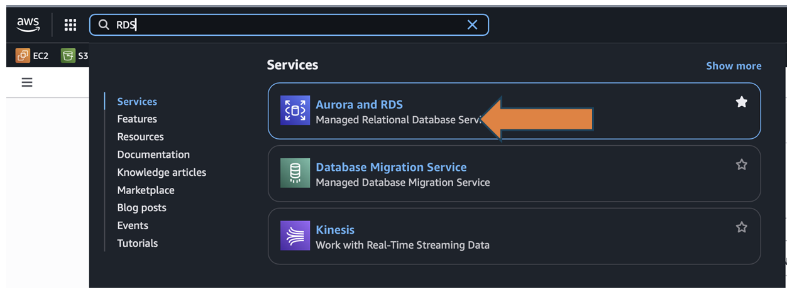

Navigate to **RDS Dashboard → Subnet groups → Create DB subnet group**

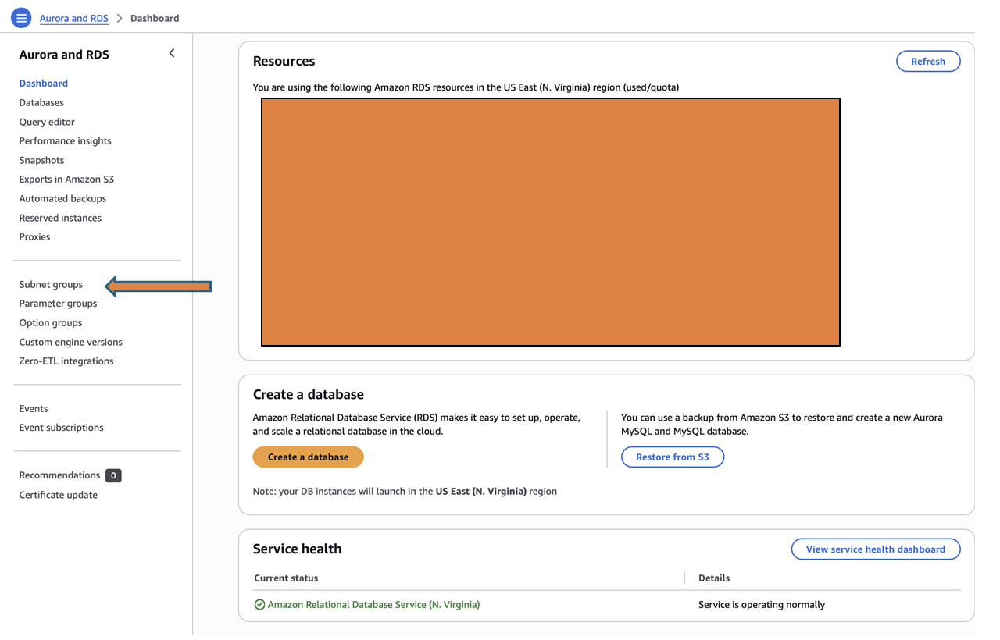

**Configuration:**

| Setting | Value |
|---------|-------|
| **Name** | `omeka-db-subnet-group` |
| **Description** | Subnet group for database instances across all environments |
| **VPC** | Select your VPC (e.g., `Omeka-Project-VPC`) |
| **Add subnets** | Select at least 2 subnets in different availability zones |

**Subnet Selection:**
- **For Private Databases (Dev/Test):** Select your private subnets
- **For Production:** Select private subnets (even production RDS should be in private subnets)

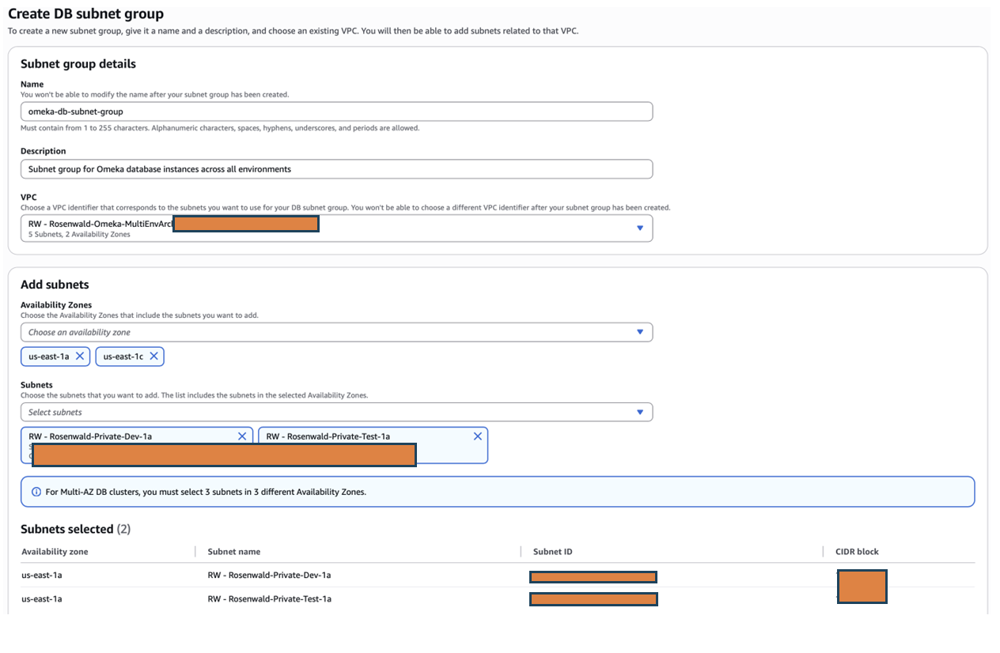

#### Step 2: Create Parameter Group

Parameter groups allow you to customize database engine configuration.

Navigate to **RDS Dashboard → Parameter groups → Create parameter group**

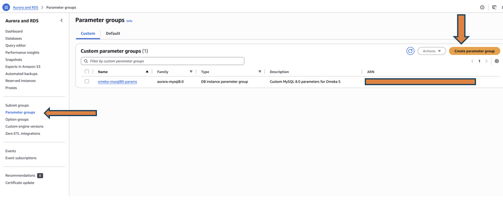

**Configuration:**

| Setting | Value |
|---------|-------|
| **Parameter group family** | `mysql8.0` |
| **Type** | DB Parameter Group |
| **Group name** | `omeka-mysql80-params` |
| **Description** | Custom MySQL 8.0 parameters for application |

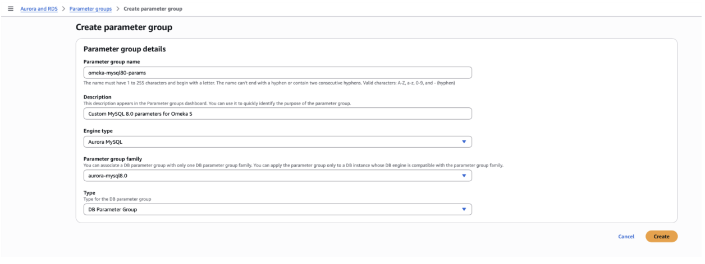

**After creation, edit the parameter group to optimize:**

| Parameter | Value | Purpose |
|-----------|-------|---------|
| `character_set_server` | `utf8mb4` | Full Unicode support |
| `collation_server` | `utf8mb4_unicode_ci` | Case-insensitive collation |
| `max_allowed_packet` | `67108864` | 64MB for large media metadata |
| `innodb_buffer_pool_size` | `{DBInstanceClassMemory*3/4}` | Memory optimization |
| `slow_query_log` | `1` | Enable performance monitoring |
| `long_query_time` | `2` | Log queries taking >2 seconds |

#### Step 3: Create RDS Instance for Each Environment

We'll create separate database instances. Here's the configuration for each environment:

##### 3.1 Navigate to Create Database

Navigate to **RDS Dashboard → Databases → Create database**

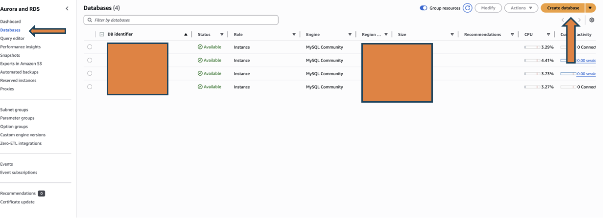

##### 3.2 Engine Options

| Setting | Value |
|---------|-------|
| **Engine type** | MySQL |
| **Engine version** | MySQL 8.0.35 (or latest 8.0.x) |
| **Templates** | Production (for prod) or Dev/Test (for other environments) |

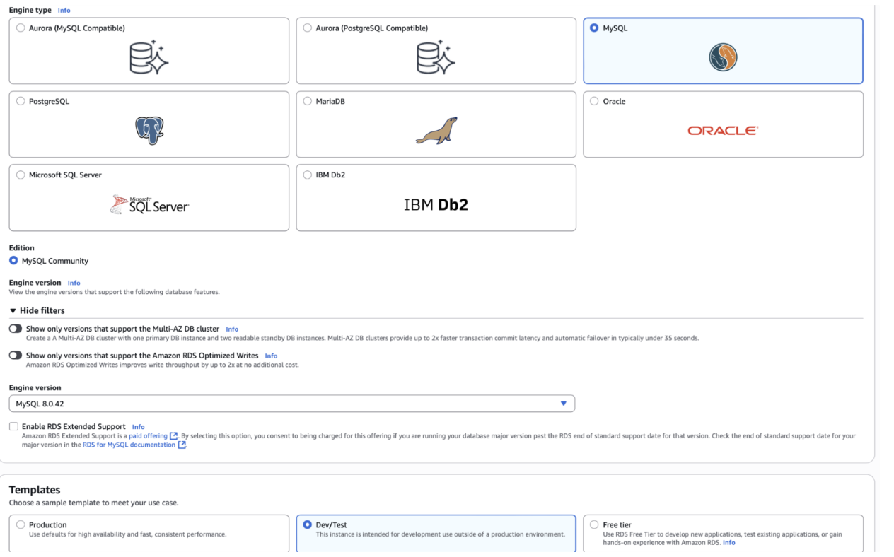

##### 3.3 Instance Configuration

| Environment | DB Instance Class | Specifications |
|------------|------------------|----------------|
| **Development** | `db.t3.micro` | 2 vCPU, 1 GiB RAM |
| **Testing** | `db.t3.small` | 2 vCPU, 2 GiB RAM |
| **Staging** | `db.t3.medium` | 2 vCPU, 4 GiB RAM |
| **Production** | `db.m5.large` | 2 vCPU, 8 GiB RAM |

**Production Only:**
- Multi-AZ deployment: **Yes** (for high availability)

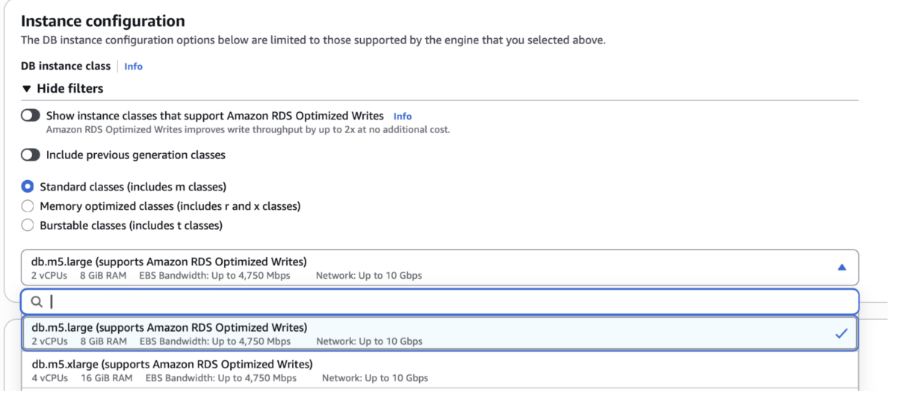

##### 3.4 Storage Configuration

| Environment | Storage Type | Allocated Storage | Storage Autoscaling | Max Threshold |
|------------|--------------|------------------|-------------------|---------------|
| **Dev/Test** | GP3 SSD | 100 GiB | Enabled | 200 GiB |
| **Staging** | GP3 SSD | 200 GiB | Enabled | 300 GiB |
| **Production** | GP3 SSD | 300 GiB | Enabled | 500 GiB |

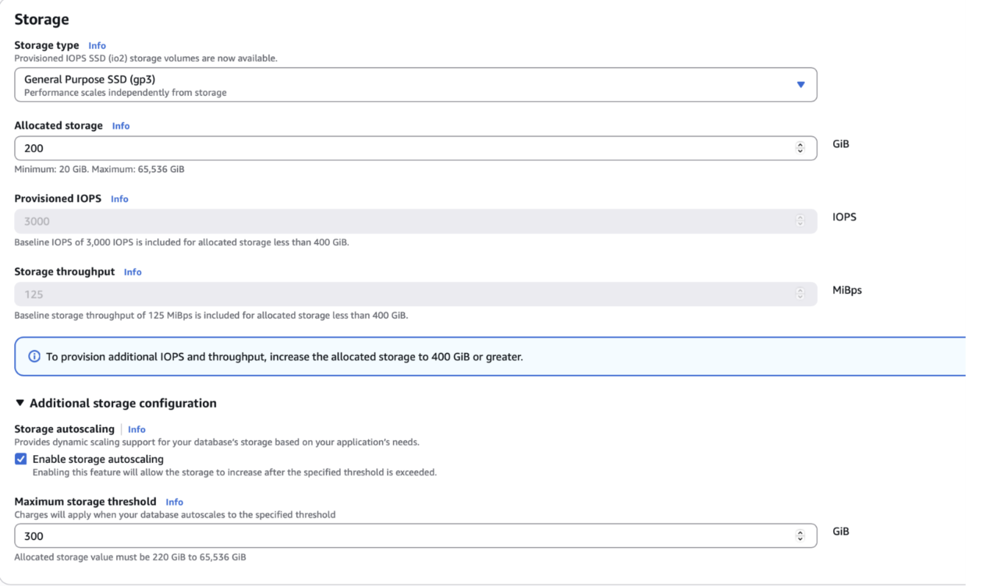

##### 3.5 Connectivity

| Setting | Value |
|---------|-------|
| **Virtual private cloud** | Select your VPC |
| **DB Subnet group** | `omeka-db-subnet-group` |
| **Public access** | **No** (always keep databases private) |
| **VPC security group** | Create new: `omeka-db-sg` |
| **Availability Zone** | No preference |
| **Database port** | 3306 |

**Security Group Configuration:**
- **Name:** `omeka-db-sg`
- **Inbound rule:** MySQL/Aurora (3306) from EC2 security groups only

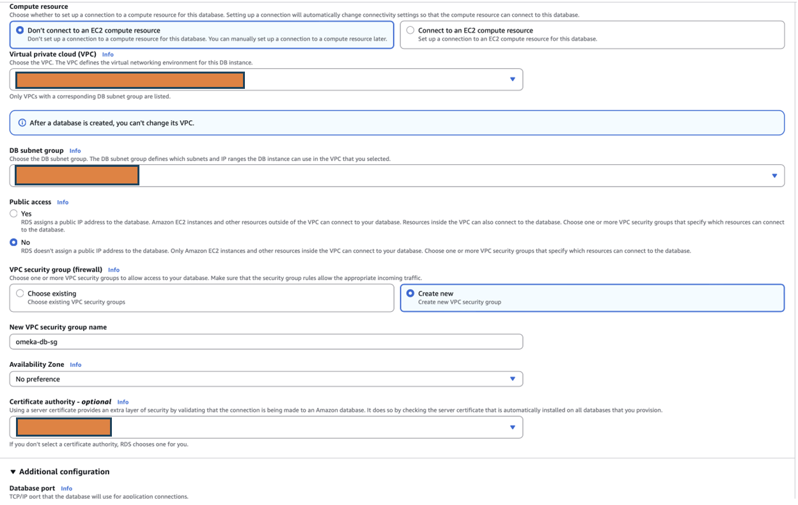

##### 3.6 Database Authentication

- **Database authentication:** Password authentication
- **Master username:** `omeka_admin`
- **Master password:** Use strong password (store in AWS Secrets Manager)

##### 3.7 Additional Configuration

**Initial Database Names:**

| Environment | Database Name |
|------------|--------------|
| **Development** | `omeka_dev` |
| **Testing** | `omeka_test` |
| **Staging** | `omeka_stage` |
| **Production** | `omeka_prod` |

**Additional Settings:**
- **DB parameter group:** `omeka-mysql80-params`
- **Option group:** `default:mysql-8-0`

##### 3.8 Backup Configuration

**Development/Testing:**
| Setting | Value |
|---------|-------|
| **Enable automated backups** | Yes |
| **Backup retention period** | 7 days |
| **Backup window** | 03:00-04:00 UTC |

**Production:**
| Setting | Value |
|---------|-------|
| **Enable automated backups** | Yes |
| **Backup retention period** | 30 days |
| **Backup window** | Choose lowest traffic period |
| **Copy tags to snapshots** | Yes |
| **Enable deletion protection** | Yes |

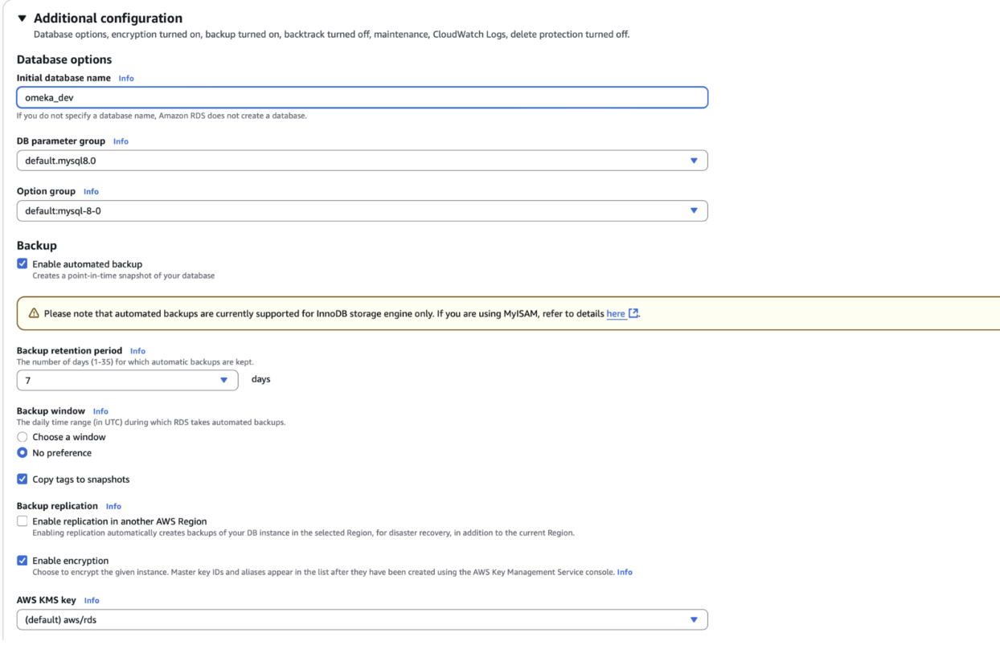

##### 3.9 Maintenance

| Setting | Value |
|---------|-------|
| **Enable auto minor version upgrade** | Yes (all environments) |
| **Maintenance window** | Sunday 04:00-05:00 UTC |

> **Note:** Choose maintenance window different from backup window

##### 3.10 Review and Create

Review all settings and click **"Create database"**

#### Step 4: Configure Database Security Groups

After creation, refine the security group rules:

1. Go to **EC2 → Security Groups**
2. Find the `omeka-db-sg` security group
3. Edit inbound rules:

**Inbound Rules Configuration:**

| Type | Protocol | Port | Source | Description |
|------|----------|------|--------|-------------|
| MySQL/Aurora | TCP | 3306 | `omeka-dev-test-sg` | Allow MySQL from Dev/Test EC2 instances |
| MySQL/Aurora | TCP | 3306 | `omeka-stage-prod-sg` | Allow MySQL from Stage/Prod EC2 instances |

#### Step 5: Verify Database Connectivity

After the database shows "Available" status (takes 5-10 minutes):

1. Note the **Endpoint address** from RDS dashboard
2. SSH into your EC2 instance through the bastion
3. Test connection:
```bash
mysql -h [your-rds-endpoint].rds.amazonaws.com -u omeka_admin -p
```

**Expected output:**
```
Welcome to the MySQL monitor.  Commands end with ; or \g.
Your MySQL connection id is 12
Server version: 8.0.35 MySQL Community Server - GPL
```

### Best Practices and Considerations

**Security:**
- Always keep RDS instances in private subnets
- Use strong, unique passwords for each environment
- Enable encryption at rest for production databases
- Regularly rotate database credentials

**Performance:**
- Monitor slow query logs regularly
- Use Performance Insights for production databases
- Consider read replicas for read-heavy workloads
- Schedule maintenance windows during low-traffic periods

**Cost Optimization:**
- Use smaller instance types for Dev/Test environments
- Consider Aurora Serverless for variable workloads
- Enable storage autoscaling to avoid overprovisioning
- Delete old manual snapshots regularly

**Disaster Recovery:**
- Test backup restoration procedures quarterly
- Document RTO/RPO requirements
- Consider cross-region backups for production
- Maintain runbooks for failover procedures

### 🎉 Milestone: Core Infrastructure Ready

**Congratulations!** You've completed the foundational infrastructure setup for your digital collections platform. 

**Infrastructure Achievement Summary:**

| Component | Status | Environments Configured |
|-----------|--------|------------------------|
| **Compute (EC2)** | ✅ Complete | 4 instances across Dev/Test/Stage/Prod |
| **Database (RDS)** | ✅ Complete | 4 MySQL instances with automated backups |
| **Network Security** | ✅ Complete | Isolated VPC with proper segmentation |
| **Access Control** | ✅ Complete | Security groups and bastion host configured |

**Your Platform Now Has:**
- **Scalable compute resources** ready to host your application
- **Managed databases** with automatic backups and high availability (production)
- **Secure network architecture** preventing unauthorized access
- **Environment isolation** enabling safe development and testing

**Connection Test Success:**
If you've successfully connected to your RDS instance from your EC2 instance, your core infrastructure is properly configured and communicating. This means:
- Network routing is correct
- Security groups are properly configured
- Database credentials are working
- Your application layer can now be deployed
---
## 3. Object Storage (S3) Architecture

### Conceptual Overview

Object storage provides a scalable, durable, and cost-effective solution for storing unstructured data such as images, videos, documents, and backups. Unlike traditional file systems, object storage uses a flat structure with unique identifiers, making it ideal for web applications that need to store and serve large amounts of media content.

In this architecture, we separate storage into two distinct buckets: one for private development/testing environments and another for public-facing staging/production environments. This separation ensures that experimental or test data never accidentally appears in production, while still maintaining a cost-effective storage strategy.

**Key Principles:**
- Unlimited scalability without capacity planning
- Built-in redundancy across multiple facilities
- Fine-grained access control through policies
- Direct web serving capability for public content
- Lifecycle management for cost optimization

### AWS Implementation: S3 Bucket Configuration

#### Step 1: Create S3 Buckets

From the AWS Console, search for **S3**, select **S3 – Scalable Storage in the Cloud**, and choose **Create bucket** in the S3 dashboard.

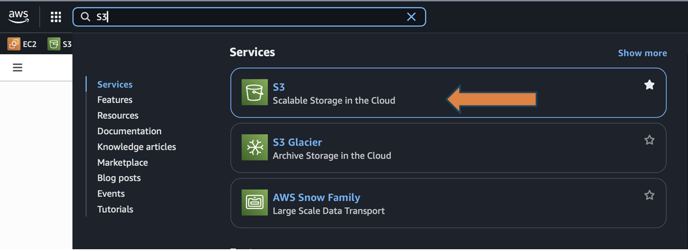

#### Step 2: Development/Test Bucket Creation

##### 2.1 General Configuration

| Setting | Value |
|---------|-------|
| **Bucket name** | `[your-institution]-omeka-dev-test` |
| **AWS Region** | Select your primary region (same as EC2) |

> **📝 Naming Requirements:**
> - Bucket names must be globally unique across all AWS
> - Use lowercase letters, numbers, and hyphens only
> - Example: `stateu-omeka-dev-test` or `stateu-omeka-prod-stage`

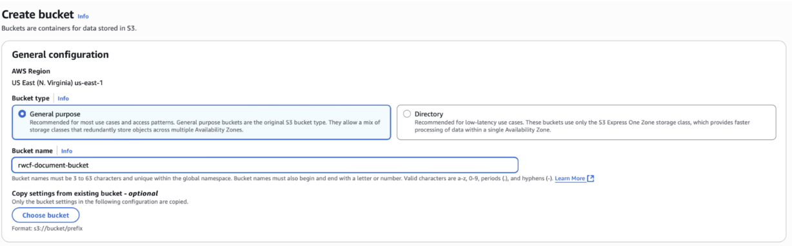

##### 2.2 Configuration Settings

**Object Ownership:**
- ACLs disabled (recommended)
- Bucket owner enforced

**Block Public Access Settings:**
- Block all public access: **Yes** (check all boxes)
- This is a private bucket for development/testing

> **⚠️ Security Note:** In the Rosenwald project we've made our buckets public, but we strictly recommend keeping them private unless your project specifically requires public access. Use bucket policies for controlled public access instead.

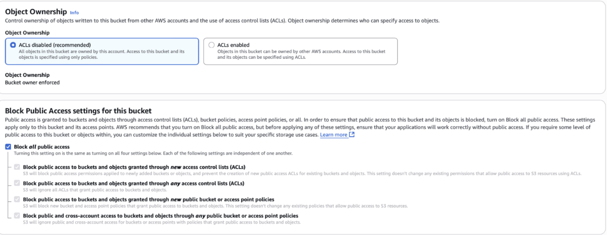

**Bucket Versioning:**

| Environment | Versioning Setting | Reason |
|------------|-------------------|---------|
| **Dev/Test** | Disable | Save costs in development |
| **Stage/Prod** | Enable | Critical for data protection |

**Default Encryption:**
- Encryption type: Server-side encryption with Amazon S3 managed keys (SSE-S3)
- Bucket Key: **Enable** (reduces encryption costs)

**Tags:**
| Key | Value |
|-----|-------|
| Environment | Dev-Test or Prod-Stage |
| Project | Omeka |
| Purpose | Media-Storage |

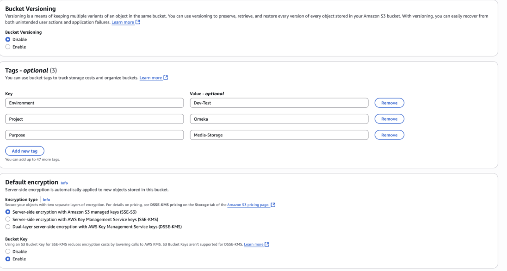

#### Step 3: Configure Bucket Folder Structure

After bucket creation, create a logical folder structure based on project requirements. Use the **Create folder** button in the S3 console.

**Recommended Structure:**
```
bucket-name/
├── dev/
│   ├── images/
│   ├── thumbnails/
│   ├── documents/
│   └── backups/
├── test/
│   ├── images/
│   ├── thumbnails/
│   └── documents/
└── temp/
```

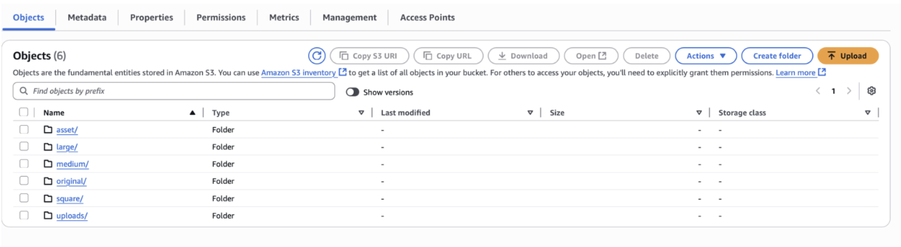

#### Step 4: Configure Bucket Policies

##### 4.1 Development/Test Bucket Policy

Navigate to **Bucket → Permissions → Bucket policy → Edit**

This policy allows only EC2 instances with specific IAM roles to access the bucket:
```json
{
    "Version": "2012-10-17",
    "Statement": [
        {
            "Sid": "AllowEC2DevTestAccess",
            "Effect": "Allow",
            "Principal": {
                "AWS": [
                    "arn:aws:iam::YOUR_ACCOUNT_ID:role/omeka-ec2-dev-role",
                    "arn:aws:iam::YOUR_ACCOUNT_ID:role/omeka-ec2-test-role"
                ]
            },
            "Action": [
                "s3:GetObject",
                "s3:PutObject",
                "s3:DeleteObject",
                "s3:ListBucket"
            ],
            "Resource": [
                "arn:aws:s3:::your-institution-omeka-dev-test/*",
                "arn:aws:s3:::your-institution-omeka-dev-test"
            ]
        },
        {
            "Sid": "DenyUnencryptedObjectUploads",
            "Effect": "Deny",
            "Principal": "*",
            "Action": "s3:PutObject",
            "Resource": "arn:aws:s3:::your-institution-omeka-dev-test/*",
            "Condition": {
                "StringNotEquals": {
                    "s3:x-amz-server-side-encryption": "AES256"
                }
            }
        }
    ]
}
```

##### 4.2 Production/Staging Bucket Policy

This policy allows public read for specific folders while maintaining write restrictions:
```json
{
    "Version": "2012-10-17",
    "Statement": [
        {
            "Sid": "PublicReadGetObject",
            "Effect": "Allow",
            "Principal": "*",
            "Action": "s3:GetObject",
            "Resource": [
                "arn:aws:s3:::your-institution-omeka-prod-stage/prod/images/*",
                "arn:aws:s3:::your-institution-omeka-prod-stage/prod/thumbnails/*",
                "arn:aws:s3:::your-institution-omeka-prod-stage/stage/images/*",
                "arn:aws:s3:::your-institution-omeka-prod-stage/stage/thumbnails/*"
            ]
        },
        {
            "Sid": "AllowEC2ProdStageAccess",
            "Effect": "Allow",
            "Principal": {
                "AWS": [
                    "arn:aws:iam::YOUR_ACCOUNT_ID:role/omeka-ec2-prod-role",
                    "arn:aws:iam::YOUR_ACCOUNT_ID:role/omeka-ec2-stage-role"
                ]
            },
            "Action": [
                "s3:GetObject",
                "s3:PutObject",
                "s3:DeleteObject",
                "s3:ListBucket"
            ],
            "Resource": [
                "arn:aws:s3:::your-institution-omeka-prod-stage/*",
                "arn:aws:s3:::your-institution-omeka-prod-stage"
            ]
        }
    ]
}
```

#### Step 5: Configure CORS Policy

For web application access, configure Cross-Origin Resource Sharing (CORS).

Navigate to **Bucket → Permissions → Cross-origin resource sharing (CORS) → Edit**
```json
[
    {
        "AllowedHeaders": [
            "Authorization",
            "Content-Type",
            "x-amz-date",
            "x-amz-security-token"
        ],
        "AllowedMethods": [
            "GET",
            "PUT",
            "POST",
            "DELETE"
        ],
        "AllowedOrigins": [
            "https://yourdomain.edu",
            "https://stage.yourdomain.edu",
            "http://localhost:8080"
        ],
        "ExposeHeaders": [
            "ETag",
            "x-amz-server-side-encryption"
        ],
        "MaxAgeSeconds": 3000
    }
]
```

#### Step 6: Configure Lifecycle Rules

Optimize storage costs by automatically transitioning or deleting old files.

Navigate to **Bucket → Management → Lifecycle rules → Create lifecycle rule**

**Lifecycle Rule Configuration:**

| Setting | Value |
|---------|-------|
| **Rule name** | `cleanup-old-files` |
| **Rule scope** | Apply to all objects in bucket |

**Lifecycle Actions:**

| Action | Timeline | Purpose |
|--------|----------|---------|
| Transition to Standard-IA | After 30 days | Reduce storage costs for infrequently accessed files |
| Transition to Glacier Instant | After 90 days | Further cost reduction for archival |
| Delete objects | After 180 days (Dev/Test only) | Remove old development files |
| Delete incomplete uploads | After 7 days | Clean up failed uploads |

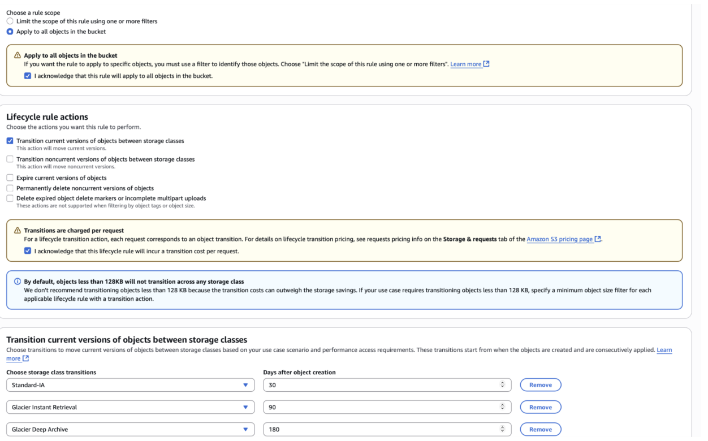

#### Step 7: Configure Bucket Metrics and Monitoring

**Enable CloudWatch Metrics:**

Navigate to **Bucket → Metrics → Request metrics → Create filter**

| Setting | Value |
|---------|-------|
| **Filter name** | `all-requests` |
| **Filter scope** | All objects |
| **Metrics** | Enable all request metrics |

**Configure Storage Class Analysis:**
1. Navigate to **Analytics → Storage Class Analysis**
2. Create new configuration
3. Name: `storage-optimization-analysis`
4. Analysis scope: Entire bucket
5. Export results: Yes (to separate analytics bucket)

#### Step 8: S3 Access Logging Configuration

Enable access logging for security and audit purposes.

**First, create a logging bucket:**
```
Bucket name: [your-institution]-logs
Block all public access: Yes
Default encryption: Enable
```

**Then configure logging on main buckets:**
1. Navigate to **Bucket → Properties → Server access logging → Edit**
2. Enable server access logging: **Yes**
3. Target bucket: Select your logs bucket
4. Target prefix: `s3-access-logs/bucket-name/`

### Best Practices and Security Considerations

**Access Control:**
- Never store AWS credentials in application code
- Use IAM roles for EC2-to-S3 access
- Regularly audit bucket policies and access logs
- Enable MFA delete for production buckets

**Cost Optimization:**
- Use lifecycle policies to transition old data to cheaper storage classes
- Enable S3 Intelligent-Tiering for unpredictable access patterns
- Monitor storage metrics to identify unused data
- Consider S3 Batch Operations for bulk actions

**Performance:**
- Use CloudFront CDN for frequently accessed public content
- Implement multipart upload for files larger than 100MB
- Use S3 Transfer Acceleration for global users
- Organize objects with logical prefixes for better performance

---

### 🏆 Achievement Unlocked: Object Storage Configured

**Infrastructure Progress Update:**

You've successfully configured the object storage layer that will house all your digital collections' media assets, documents, and backups. Your S3 buckets are now ready to securely store and serve content at any scale.

**What You've Accomplished:**
- ✅ **2 S3 buckets created** with appropriate separation between Dev/Test and Stage/Prod
- ✅ **Security policies configured** to restrict access to authorized EC2 instances only
- ✅ **Lifecycle rules established** for automatic cost optimization
- ✅ **CORS configured** for web application integration
- ✅ **Monitoring enabled** for usage tracking and security auditing

**Your Storage Architecture Now Provides:**
- **Unlimited scalability** - Store petabytes of data without capacity planning
- **11 9's of durability** - Your data is replicated across multiple facilities
- **Granular access control** - Only authorized services can access specific resources
- **Cost optimization** - Automatic transitioning to cheaper storage classes over time
- **Web-ready serving** - Direct HTTPS access for public media content

**Integration Points Established:**
Your S3 buckets are now ready to integrate with:
- EC2 instances (via IAM roles we'll configure next)
- CloudFront CDN (optional, for global content delivery)
- Your application layer for media uploads and retrieval

**Next Steps:**
With compute (EC2), database (RDS), and storage (S3) layers complete, we'll move on to:
- **IAM Configuration** - Set up the roles and policies that securely connect all services
- **Route 53** - Configure DNS for user-friendly access
- **SSL Certificates** - Enable secure HTTPS connections


You're now 75% complete with your core infrastructure setup! The heavy lifting is done – what remains is primarily configuration and security refinement.

---

## 4. IAM (Identity and Access Management) Configuration

### Conceptual Overview

Identity and Access Management controls who can access your cloud resources and what actions they can perform. The principle of **least privilege** is fundamental - each component should have only the minimum permissions necessary to function. In this architecture, we create specific roles for EC2 instances to access S3 buckets and other AWS services, eliminating the need to store access keys on servers.

**Key IAM Components:**
- **Roles:** Collections of permissions that EC2 instances can assume
- **Policies:** JSON documents defining specific permissions
- **Instance Profiles:** Containers for roles that can be attached to EC2 instances
- **Service-to-service authentication:** Secure access without storing passwords

### AWS Implementation: IAM Roles and Policies

#### Step 1: Create IAM Policies for S3 Access

Navigate to **IAM Console → Policies → Create policy**

##### 1.1 Development Environment S3 Policy

**Policy Name:** `omeka-dev-s3-access`

Select JSON editor and input:
```json
{
    "Version": "2012-10-17",
    "Statement": [
        {
            "Sid": "ListBucketContents",
            "Effect": "Allow",
            "Action": [
                "s3:ListBucket",
                "s3:GetBucketLocation",
                "s3:GetBucketVersioning"
            ],
            "Resource": "arn:aws:s3:::your-institution-omeka-dev-test",
            "Condition": {
                "StringLike": {
                    "s3:prefix": ["dev/*"]
                }
            }
        },
        {
            "Sid": "ReadWriteDeleteDevObjects",
            "Effect": "Allow",
            "Action": [
                "s3:GetObject",
                "s3:GetObjectVersion",
                "s3:PutObject",
                "s3:DeleteObject",
                "s3:DeleteObjectVersion"
            ],
            "Resource": "arn:aws:s3:::your-institution-omeka-dev-test/dev/*"
        },
        {
            "Sid": "MultipartUploadPermissions",
            "Effect": "Allow",
            "Action": [
                "s3:ListMultipartUploadParts",
                "s3:AbortMultipartUpload"
            ],
            "Resource": "arn:aws:s3:::your-institution-omeka-dev-test/dev/*"
        }
    ]
}
```

**Tags to add:**
| Key | Value |
|-----|-------|
| Environment | Development |
| Application | Omeka |

##### 1.2 Production Environment S3 Policy

**Policy Name:** `omeka-prod-s3-access`
```json
{
    "Version": "2012-10-17",
    "Statement": [
        {
            "Sid": "ListBucketContents",
            "Effect": "Allow",
            "Action": [
                "s3:ListBucket",
                "s3:GetBucketLocation",
                "s3:GetBucketVersioning"
            ],
            "Resource": "arn:aws:s3:::your-institution-omeka-prod-stage",
            "Condition": {
                "StringLike": {
                    "s3:prefix": ["prod/*"]
                }
            }
        },
        {
            "Sid": "ReadWriteDeleteProdObjects",
            "Effect": "Allow",
            "Action": [
                "s3:GetObject",
                "s3:GetObjectVersion",
                "s3:PutObject",
                "s3:DeleteObject",
                "s3:DeleteObjectVersion",
                "s3:GetObjectAcl",
                "s3:PutObjectAcl"
            ],
            "Resource": "arn:aws:s3:::your-institution-omeka-prod-stage/prod/*"
        }
    ]
}
```

> **📝 Note:** Create similar policies for Testing (`omeka-test-s3-access`) and Staging (`omeka-stage-s3-access`) environments with appropriate resource paths.

#### Step 2: Create CloudWatch Logs Policy

**Policy Name:** `omeka-cloudwatch-logs`
```json
{
    "Version": "2012-10-17",
    "Statement": [
        {
            "Sid": "CreateLogGroup",
            "Effect": "Allow",
            "Action": [
                "logs:CreateLogGroup",
                "logs:CreateLogStream"
            ],
            "Resource": "arn:aws:logs:us-east-1:YOUR_ACCOUNT_ID:log-group:/aws/ec2/omeka/*"
        },
        {
            "Sid": "WriteLogEvents",
            "Effect": "Allow",
            "Action": [
                "logs:PutLogEvents",
                "logs:DescribeLogStreams"
            ],
            "Resource": "arn:aws:logs:us-east-1:YOUR_ACCOUNT_ID:log-group:/aws/ec2/omeka/*:*"
        }
    ]
}
```

#### Step 3: Create IAM Roles for EC2 Instances

Navigate to **IAM Console → Roles → Create role**

##### 3.1 Development EC2 Role Configuration

**Trust Entity Selection:**
- Trusted entity type: AWS service
- Use case: EC2

**Attach Permissions Policies:**

| Policy Name | Type | Purpose |
|------------|------|---------|
| `omeka-dev-s3-access` | Custom | S3 bucket access for dev environment |
| `omeka-cloudwatch-logs` | Custom | CloudWatch logging capabilities |
| `AmazonSSMManagedInstanceCore` | AWS Managed | Systems Manager access for maintenance |
| `CloudWatchAgentServerPolicy` | AWS Managed | Metrics and monitoring |

**Role Details:**
- Role name: `omeka-ec2-dev-role`
- Description: IAM role for development EC2 instances

**Create Similar Roles For:**

| Environment | Role Name |
|------------|-----------|
| Testing | `omeka-ec2-test-role` |
| Staging | `omeka-ec2-stage-role` |
| Production | `omeka-ec2-prod-role` |

#### Step 4: Create IAM Role for RDS Enhanced Monitoring

**Role Name:** `omeka-rds-enhanced-monitoring`

**Configuration:**
- Select trusted entity: AWS service → RDS → RDS Enhanced Monitoring
- Attach policy: `AmazonRDSEnhancedMonitoringRole` (AWS managed)

#### Step 5: Create IAM User for Backup Management (Optional)

Navigate to **IAM → Users → Add users**

**User Configuration:**
- User name: `omeka-backup-manager`
- Access type: Programmatic access only

**Create Custom Backup Policy:**
```json
{
    "Version": "2012-10-17",
    "Statement": [
        {
            "Sid": "S3BackupAccess",
            "Effect": "Allow",
            "Action": [
                "s3:ListBucket",
                "s3:GetObject",
                "s3:PutObject"
            ],
            "Resource": [
                "arn:aws:s3:::your-institution-omeka-*/backups/*"
            ]
        },
        {
            "Sid": "RDSSnapshotAccess",
            "Effect": "Allow",
            "Action": [
                "rds:CreateDBSnapshot",
                "rds:DescribeDBSnapshots",
                "rds:CopyDBSnapshot"
            ],
            "Resource": [
                "arn:aws:rds:*:YOUR_ACCOUNT_ID:db:omeka-*",
                "arn:aws:rds:*:YOUR_ACCOUNT_ID:snapshot:*"
            ]
        }
    ]
}
```

#### Step 6: Configure IAM Password Policy

Navigate to **IAM → Account settings → Password policy**

**Recommended Password Requirements:**

| Setting | Value |
|---------|-------|
| Minimum password length | 14 characters |
| Require uppercase letter | Yes |
| Require lowercase letter | Yes |
| Require numbers | Yes |
| Require non-alphanumeric | Yes |
| Enable password expiration | 90 days |
| Prevent password reuse | 5 passwords |

#### Step 7: Attach IAM Roles to EC2 Instances

For existing EC2 instances, attach the appropriate IAM role:

1. Navigate to **EC2 Console → Instances**
2. Select the instance
3. Click **Actions → Security → Modify IAM role**
4. Select the appropriate role (e.g., `omeka-ec2-dev-role` for development instance)
5. Click **Update IAM role**

### Security Best Practices

**Access Management:**
- Review IAM permissions quarterly
- Remove unused roles and policies
- Enable MFA for all IAM users
- Use temporary credentials where possible

**Policy Design:**
- Always use the principle of least privilege
- Avoid using wildcard (*) permissions in production
- Use conditions to restrict access by IP, time, or other factors
- Document the purpose of each custom policy

**Monitoring:**
- Enable CloudTrail for IAM activity logging
- Set up alerts for unauthorized access attempts
- Review access advisor reports regularly
- Use AWS Access Analyzer to identify overly permissive policies

---

### 🔐 Security Layer Established: IAM Configuration Complete

**Access Control Architecture Deployed**

You've successfully implemented a comprehensive Identity and Access Management structure that ensures secure, granular access control across your infrastructure.

**What You've Accomplished:**
- ✅ **Custom IAM policies created** for environment-specific S3 access
- ✅ **EC2 roles configured** enabling secure service-to-service communication
- ✅ **CloudWatch logging permissions** established for monitoring
- ✅ **RDS monitoring role** set up for database performance insights
- ✅ **Password policy enforced** meeting security best practices

**Security Benefits Achieved:**
- **Zero stored credentials** - EC2 instances use roles, not access keys
- **Principle of least privilege** - Each service has only required permissions
- **Environment isolation** - Dev cannot access Prod resources
- **Audit trail ready** - All actions are attributable and logged
- **Automated access** - No manual key rotation needed

**How Your Services Now Connect:**
```
EC2 Instance (with IAM Role)
    ↓
Assumes Role Automatically
    ↓
Gets Temporary Credentials
    ↓
Accesses S3 Buckets & CloudWatch
```

**Validation Checklist:**
- [ ] Verify EC2 instances have IAM roles attached
- [ ] Test S3 access from an EC2 instance
- [ ] Confirm CloudWatch logs are being written
- [ ] Review policies for any overly broad permissions

**Infrastructure Status:**
| Component | Status | Security Level |
|-----------|--------|----------------|
| Compute (EC2) | ✅ Complete | IAM roles attached |
| Database (RDS) | ✅ Complete | Network isolated |
| Storage (S3) | ✅ Complete | Policy protected |
| Access Control (IAM) | ✅ Complete | Least privilege enforced |

**Next Steps:**
With IAM providing the security fabric connecting all services, we'll configure:
- **Route 53** - DNS for user-friendly domain access
- **SSL/TLS Certificates** - Secure HTTPS connections

You've now completed the core security configuration that will protect your digital collections platform throughout its lifecycle. The infrastructure is not only functional but also follows AWS security best practices.

**Current Setup Time:** ~3-4 hours invested
**Security Posture:** Production-ready with defense in depth

---

## Change History

| Version | Date | Author | Description |
|---------|------|--------|-------------|
| 1.0 | Oct 17 2025 | Sai Kiran Boppana | Initial runbook creation |
| 1.1 | Oct 17 2025 | Sai Kiran Boppana | Add EC2 Virtual Server Provisioning |
| 1.2 | Oct 17 2025 | Sai Kiran Boppana | RDS Confirugration |
| 1.3 | Oct 17 2025 | Sai Kiran Boppana | S3 Object Architecture |
| 1.4 | Oct 18 2025 | Sai Kiran Boppana | IAM Configuration |

---

**Next Section:** 5. Route 53 (DNS) Configuration 


